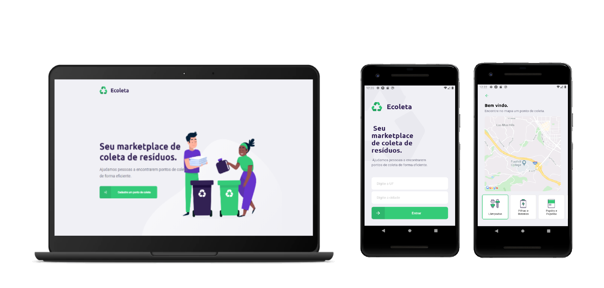

<h1 align="center">
    Ecoleta
</h1>

## Projeto

O Ecoleta é um marketplace que ajuda pessoas a encontrarem pontos de coleta de resíduos de forma eficiente. Esse projeto foi realizado durante a Next Level Week #1 da RocketSeat.

## Aplicação

  
 

## Tecnologias

- Node
- React
- React Native
- Expo
- SQL lite
- Knex

## Desenvolvimento

Para inicializar o projeto web ou mobile é preciso utilizar o comando abaixo:

### `yarn start`

Roda a aplicação no ambiente de desenvolvimento. 
A aplicação irá abrir no dominio: [http://localhost:3000](http://localhost:3000) para visualização no browser.

Enquanto para visualizar o mobile é preciso de um emulador ou pelo proprio celular pelo aplicato do Expo.

Para inicializar o servidor é preciso utilizar o comando abaixo:

### `yarn dev`
